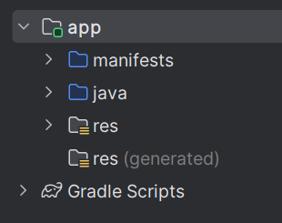
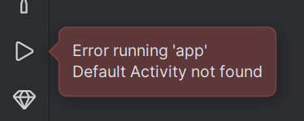
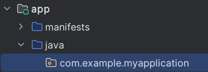
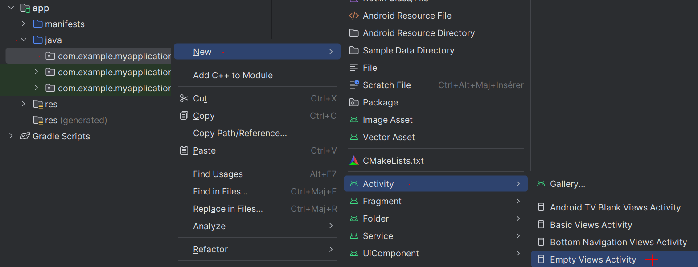
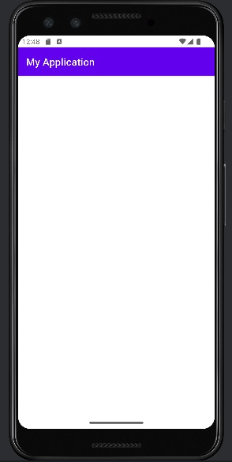

# Rappel à propos d'android studio
Android studio est un framework qui permet le développement d'application Android aussi bien pour mobile, tv ou encore montre connectées.

Android permet d'émuler ou de brancher un telephone android pour pouvoir tester en temps réel notre application.

Chaque application android est un processus linux unique qui peut posséder plusieurs composants.
> Un process linux est un simple programme qui tourne sur l'OS. Pensez au processus du gestionnaire de taches Windows, c'est la même logique.

Un composants est un bloc d'une application android, il en existent 4 types : 
- Activity, une page de notre application.
- Service, la logique non-UI de notre application.
- BroadcastReceiver 
- ???

La spécificité des applications Android c'est leurs capacité à rendre accessible leurs composants aux autres applications android présente sur le téléphone.
Pensez par exemple au partage d'une vidéo sur l'application youtube par mail qui ouvre une fenetre *Ouvrir avec*.

Si l'utlisateur à l'intention d'envoyer un mail depuis une application le systeme endroit va rechercher des applications qui sont capable de repondre à cette intention. On appel cette méchanique les ***intents*** (intention).

Un exemple basique d'intention c'est l'intention LAUNCHER que l'utilisteur provoque lorsqu'il touche l'icone d'une application. Nous allons pouvoir définir une activiy à lancez lorsque cette intention se produit. C'est comme ça que l'on défini d'ailleurs le point d'entrée d'une application android.

## Un application android au minimum c'est quoi ?
Au minimum une application android c'est un processus linux qui a pris une Activity comme point de démarrage.

Pour créer une application Android il faut donc :
1. Créer un projet vide avec Android studi
2. Créer une activity vierge
3. Définir cette activité comme point de démarrage de notre application.

## Créer un projet android vierge
### Nouveau projet
Dans android studio on peut choisir le layout *No activity* qui permet d'avoir un projet vide sans ancune activity.

> Vous pouvez également prendre un layout déjà établit pour partir d'un sequelette d'application plus avancez.

Donnez un nom à votre application

Définissez le langage de programmation utilisez

Ainsi que le builder

### Interface d'android studio
Une fois le projet crée vous arrivez sur l'interface d'android studio.

Vous y trouvez vos fichiers :

- manifests, défini les activity du projets (les pages)
- java, contient le code source de nos composants (activity et autres).
- res, contiendra les vues xml de nos activity.

### Démarrer l'application
Si vous cliquez sur play l'application va tentez de démarrer et un message d'erreur apparaitera.


*Error running 'app'. Default activity not found*
Cela veut simplement dire que notre application n'à pas sur quelle activity lancer au démarrage. Et c'est bien normal notre projet n'en contient aucune.

### Créer une activity
Les activity se trouvent dans le package principale de votre application.

Pour créer une activity il suffit d'effectuer un clic droit sur le package et selectionner *Empty View Activity*.


Si je lance à nouveau mon application.

Je reçois toujours la même erreur.
Une activity a bien été crée mais elle na jamais été définir comme point d'entrée de l'application.

### Définir l'activity comme point d'entrée de l'application.

Pour définir l'activity comme point d'entrée de l'application il faut modifier le ficheir manifest.xml.

1. Définir un intent-filter qui va écouter la catégorie d'intention LAUNCHER, c'est à dire l'intention du client de lancer notre application.
2. Ensuite définir une action MAIN dans cette intent-filter qui défini l'activity nouvellement crée comme le point d'entrée de l'application.

> Une fois le point d'entrée défini l'OS Android va pouvoir crée un nouveau processus linux et ainsi lancer notre appli.

#### intent-filter
Dans manifest.xml vous devrier avoir quelque chose comme ceci :
```xml
<?xml version="1.0" encoding="utf-8"?>
<manifest xmlns:android="http://schemas.android.com/apk/res/android"
    xmlns:tools="http://schemas.android.com/tools">

    <application
        android:allowBackup="true"
        android:dataExtractionRules="@xml/data_extraction_rules"
        android:fullBackupContent="@xml/backup_rules"
        android:icon="@mipmap/ic_launcher"
        android:label="@string/app_name"
        android:roundIcon="@mipmap/ic_launcher_round"
        android:supportsRtl="true"
        android:theme="@style/Theme.MyApplication"
        tools:targetApi="31">
        <activity
            android:name=".MainActivity"
            android:exported="false" />
    </application>

</manifest>
```
On peut voir que dans la balise application se trouve une balise activity.
C'est dans cette balise activity que l'on va pouvoir ajouter un intent-filter et ainsi définir le point d'entrée de l'application.

1. Ouvrez la balise activity et exportez l'activity pour quelle soit visible de l'OS.
```xml
<activity
            android:name=".MainActivity"
            android:exported="true"
            >

</activity>
```
2. Dans la balise activity ajouter un intent-filter qui va filter les intentions system qui permettent de lancer cette activity.
```xml
<activity
            android:name=".MainActivity"
            android:exported="true"
            >
            <intent-filter>
                <category android:name="android.intent.category.LAUNCHER" />
                <action android:name="android.intent.action.MAIN" />
            </intent-filter>
        </activity>
```
la balise category permet de définir à quelle intention correspond l'activity. LAUNCHER correspond à l'intention de lancer l'application (touche sur l'icone de l'appli).
```xml
<category android:name="android.intent.category.LAUNCHER" />
```
La balise action défini l'action à executer. ACTION_MAIN permet de lancer une nouvelle appli avec comme point d'entrée l'activity.
```xml
<action android:name="android.intent.action.MAIN" />
```

#### Lancement de l'application.
Voilà maintenant que :
- Une activity est crée
- Qu'un intent-filter défini l'activity comme point d'entrée

L'application va enfin démarrer.


## Ajouter un élément d'UI et le remplir avec un variable
### TextView


### get TextView by id

### view.setValue()

## Effectuer une requete HTTP sur un back-end
### Effectuer une requete http

### Le multi-threading

### L'encapsulation dans une class Facade.