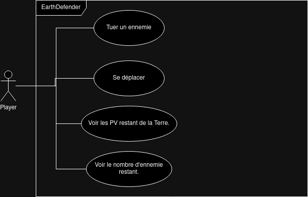
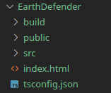

# La POO par l'exemple - EarthDefender

Pour apprendre la POO nous allons conçevoir un petit jeu vidéo nommée *EarthDefender*.


## Pré-requis
- Avoir fini le TP 1 sur HTML Canvas et *EarthDefender* sans POO

## Concept du jeu
Ce jeu est une version simplifié de *SpaceInvader* où un petit vaisseau spacial détruit des aliens pour proteger la Terre.

Les aliens se déplacent vers la terre et lui font perdre des points de vie lors de leurs collisions. 

Le joueur contrôle le vaisseau spacial, il se déplace latéralement. Il peut également tirer des missiles qui détruisent alors un alien lors de la collision.


Retrouvez toute les assets graphiques du projet via ce lien figma : https://www.figma.com/file/Th3KWNwiV7TtXDKNSMv6do/EarthDefender?type=design&node-id=0%3A1&mode=design&t=MUCNIKJfrDGeNUtj-1

## Use Case Diagramme
Voici le diagramme de cas d'utilisation de l'application.


## Technologies néccessaires

- NPM
- TypeScript
- HTML Canva

Cette application à besoin d'une haute intéractivité il nous faudra donc JavaScript, nous utiliserons également un Canva HTML pour afficher le jeu.

Nous utiliseront TypeScript plutôt que JavaScript pour sa syntaxe Orientée Objet. TypeScript néccessitera cependant de compiler le code en JavaScript.

TypeScript est un surcouche de JavaScript développé par Microsoft, il renforce JavaScript en lui rajoutant les types, c'est un langage moins permissif que JavaScript et il est obligatoire de le connaitre pour utiliser, à l'avenir, le framework Angular. Tout code TypeScript sera de toute façon au final tranformé en code JavaScript après la compilation.

> A l'origine TypeScript a été crée par Microsoft pour faciliter le développement des versions Web de la suite Office. Le premier programme développé en TypeScript est VSCode. Le développement de VSCode à permit à Microsoft de tester TypeScript en condition réel. Pour plus d'info je recommande ce documentaire sur les conditions de développement de TypeScript : https://www.youtube.com/watch?v=U6s2pdxebSo&t=2189s.

## Cahier des charges
|Tache|Description|Contraintes|
|-|-|-|
| Créer le canva du jeu | Le HTML Canva est un rectangle qui prend presque tout l'écran | Il possède un fond d'écran similaire à celui de la maquette |
|Afficher le joueur| Afficher le joueur sur le HTML Canva. | Le joueur se trouve à quelque pixels du bord inférieur du canva.|
| Mouvement du joueur| Le joueur peut se déplacer de gauche à droite avec les touches 'Q' ou 'D'.|
| Apparition d'un Alien |Faire apparaitre un alien | L'alien avance tout droit vers le bas du canva.|
|Afficher la Terre | La terre possède 3 PV | Afficher les pv restant de la terre |
| Perte de pv de la terre | La terre perd 1 pv si un alien la touche |
| Mort du joueur | Le joueur meurt si un alien le touche. | Le jeu recommence |
| Tir du joueur| Le joueur tir des missiles qui détruisent un alien au contact | Les missiles vont tout droit vers le haut de l'écran. La touche espace tir un missile. Le joueur peut tirer à une cadence maximum de 200ms |
| Vague d'aliens | Faire apparaitre de nombreux aliens qui arriveront petit à petit de façon aléotoire. |  Il n'y maximum que 10 aliens en jeu et le nombres d'alien tué est affiché en haut de l'écran. |
| Bonus SON Joueur | Emmettre un son au tir du joueur |
| Bonus SON musique | Faire tourner une musique en boucle en fond. |

## Mise en place du projet

### Logiciel pré-requis
Installation de TypeScript Compiler
```bash
npm install -g typescript
```
### Arborsecence

- `build` contient le code JS compilé
- `src` contient notre code TypeScript (TS)
- `public` contient les assets : images, sons.
- `index.html` la page d'accueil du site.
- `tsconfig.json` configure le compilateur TS

### tsconfig.json
```json
{
    "compilerOptions": {
        "rootDir": "./src",
        "outDir": "./build",
        "module": "ESNext"
    }
}
```
### Compiler le TS
Dans un fichier */src/script.ts*
```ts
const gameName : string = "EarthDefender!";
console.log(gameName);
```
Dans un fichier */index.html*
```html
<!DOCTYPE html>
<html lang="fr">
<head>
    <meta charset="UTF-8">
    <meta name="viewport" content="width=device-width, initial-scale=1.0">
    <title>Earth Defender</title>
    <style>
        canvas{
            border : 1px solid black;
        }
    </style>
</head>
<body>
    <canvas>

    </canvas>
</body>
<script type="module" src="./build/script.js"></script>
</html>
```

Lancez le compilateur TypeScript en *watchmode* avec la commande :
```bash
tsc -w
```
> Il faut être à la racine du dossier au même niveau que le fichier *tsconfig.json*.

*Résultat dans la console du navigateur*


Si vous avez le message dans la console tout roule !

## Partie 1 - Initialisation du programme

### Chapitre 1 - Afficher le jeu
Créez un dossier nommé `Classes` dans `src`, il contiendra toutes nos classes.

*/src/Classes/Game.ts*
```ts
export class Game{
    /**
     * Public attributs
     */


    /**
     * Private attributs
     */
    private context : CanvasRenderingContext2D;
    private readonly CANVAS_WIDTH : number = 900;
    private readonly CANVAS_HEIGHT : number = 600;
    
    constructor(){
        // Init Game canvas
        const canvas : HTMLCanvasElement = document.querySelector("canvas");
        canvas.height = this.CANVAS_HEIGHT;
        canvas.width = this.CANVAS_WIDTH;
        this.context = canvas.getContext("2d");
    }
}
```

J'importe ensuite la classe Game pour instancier une partie dans le fichier script.ts.

*src/script.ts*
```ts
import {Game} from "./Classes/Game.js";

const game = new Game();
```
> Pour éviter les soucis de type de fichier lors de l'import des scripts par le navigateur, précisez bien `Game.js` et non `Game.ts` dans l'import.
> Ce sera le nom final du script après compilation et c'est de ce nom dont le navigateur aura besoin.

La méthode `Game.start()` lancera le jeu c'est donc dans cette méthode que nous allons, pour l'instant, colorier le fond du jeu.

J'ajoute la méthode start().

*src/Classes/Game.ts*
```ts
export class Game{
    // Public attributs
    
    // Private attributs
    private context : CanvasRenderingContext2D;
    private readonly CANVAS_WIDTH : number = 900;
    private readonly CANVAS_HEIGHT : number = 600;
    
    constructor(){
        // Init Game canvas
        const canvas : HTMLCanvasElement = document.querySelector("canvas");
        canvas.height = this.CANVAS_HEIGHT;
        canvas.width = this.CANVAS_WIDTH;
        this.context = canvas.getContext("2d");
    }

    // Public methods

    public start() : void{
        // Clear context
        this.context.clearRect(0,0,this.CANVAS_WIDTH,this.CANVAS_HEIGHT);
        this.context.fillStyle = "#141414";
        this.context.fillRect(0,0,this.CANVAS_WIDTH,this.CANVAS_HEIGHT);
    }
}
```

Et je l'appel dans script.ts pour lancer le jeu.

*src/script.ts*
```ts
import {Game} from "./Classes/Game.js";

const game = new Game();
game.start();
```

*Résultat :  un canvas noir*


### Chapitre 2 - Créer un afficher un GameObject
Nous allons maintenant afficher notre premier gameObject à l'écran.

Nous allons avoir besoin d'image pour nos gameObjects.
Vous pouvez donc copier les assets graphiques qui se trouve dans le lien figma dans un dossier `/public/assets/images`.
Voici une image par défaut pour les GameObject

*DefaultGameObject.png*


Importez la dans le fichier index.html

*index.html*
```html
<!DOCTYPE html>
<html lang="fr">
<head>
    <meta charset="UTF-8">
    <meta name="viewport" content="width=device-width, initial-scale=1.0">
    <title>Earth Defender</title>
    <style>
        canvas{
            border : 1px solid black;
        }
    </style>
</head>
<body>
    
    <canvas>

    </canvas>
</body>
<script type="module" src="./build/script.js"></script>
</html>
```

#### Attendre le chargement des images

Le jeu doit se lancer une fois toutes les images chargées.
Il faut donc attendre le chargement de la page avec la fonction onload avant de démarrer le jeu.

*/src/script.ts*
```ts
import {Game} from "./Classes/Game.js";

window.onload = ()=>{
    const game = new Game();
    game.start();
}
```

#### Créer un GameObject

Dans un dossier /src/Classes/GameObjects crée un fichier nommée GameObject.ts

*src/Classes/GameObjects/GameObject.ts*
```ts
export class GameObject{

    
    constructor(){
    }
}
```

#### La position d'un GameObject
La position d'un GameObject est défini par deux number x et y.
Créons donc un interface Position qui possède deux attributs x et y;

*/src/Classes/Position.ts*
```ts
export interface Position{
    x : number;
    y : number;
}
```

Ajoutons ensuite une position a notre GameObject.

*/src/Classes/GameObjects/GameObject.ts*
```ts
import { Position } from "../Position.js";

export class GameObject{
    
    private position : Position;
    
    constructor(){
        this.position = {
            x : 0,
            y : 0
        };
    }
}
```

#### L'image d'un gameObject

> Assurez vous qu'un balise image avec pour id *asset_default* existe dans le index.html

Notre jeu contiendra de nombreux assets graphique. En POO chaque classe a sa propre résponsabilité; il faut donc crée une classe `Assets` qui gère les assets graphiques.

*/src/Classes/Assets.ts*
```ts
export class Assets{
    public static getDefaultImage(){
        const image : HTMLImageElement = document.querySelector("img#asset_default");
        if(image == null){
            throw Error("No assets found");
        }
        return image;
    }
}
```
> Notez que nous provoquons une erreur si l'image n'est pas trouvée. La bonne pratique veux que l'on privilégie `throw` en cas d'erreur plutôt qu'une valeur de retour comme `null`.

Une fois la fonction getter ajoutée je peux m'en servir dans le constructeur de GameObject.

```ts
import { Assets } from "../Assets.js";
import { Position } from "../Position.js";

export class GameObject{
    
    private position : Position;
    private image : HTMLImageElement;
    
    constructor(){
        this.position = {
            x : 0,
            y : 0
        };
        // Assets ne possède que des méthodes static
        // Car je n'ai besoin que d'une seul instance de Assets
        this.image = Assets.getDefaultImage();
    }
}
```
#### Affichage du GameObject
Pour afficher le gameObject je veux ajouter une méthode draw à la classe Game qui utilise la méthode `context.drawImage()`.

J'ai besoin d'une image et de la position du GameObject pour déssiner une image. Seulement ces données sont privées. Je vais donc créer des getter dans la classe GameObject.

```ts
import { Assets } from "../Assets.js";
import { Position } from "../Position.js";

export class GameObject{
    
    private position : Position;
    private image : HTMLImageElement;
    
    constructor(){
        this.position = {
            x : 0,
            y : 0
        };
        this.image = Assets.getDefaultImage();
    }

    // Getter d'image et de position
    public getImage() : HTMLImageElement{
        return this.image;
    }
    public getPosition() : Position{
        return this.position;
    }
}
```

J'ajoute ensuite ma méthode draw pour dessiner un GameObject.

Elle prend  en paramètre un GameObject et le dessine avec la méthode `context.drawImage()` :

```ts
import { GameObject } from "./GameObjects/GameObject.js";

export class Game{
    // Public attributs
    
    // Private attributs
    private context : CanvasRenderingContext2D;
    private readonly CANVAS_WIDTH : number = 900;
    private readonly CANVAS_HEIGHT : number = 600;
    
    constructor(){
        // Init Game canvas
        const canvas : HTMLCanvasElement = document.querySelector("canvas");
        canvas.height = this.CANVAS_HEIGHT;
        canvas.width = this.CANVAS_WIDTH;
        this.context = canvas.getContext("2d");
    }

    // Public methods

    public start() : void{
        // Clear context
        this.context.clearRect(0,0,this.CANVAS_WIDTH,this.CANVAS_HEIGHT);
        this.context.fillStyle = "#141414";
        this.context.fillRect(0,0,this.CANVAS_WIDTH,this.CANVAS_HEIGHT);
    }

    //  La fonction draw qui affiche un gameObject
    private draw(gameObject : GameObject){
        this.context.drawImage(
            gameObject.getImage(),
            gameObject.getPosition().x,
            gameObject.getPosition().y,
            gameObject.getImage().width,
            gameObject.getImage().height
        );
    }
}
```

Il ne me reste plus qu'à utiliser cette méthode dans la méthode start().

```ts
public start() : void{
        // Clear context
        this.context.clearRect(0,0,this.CANVAS_WIDTH,this.CANVAS_HEIGHT);
        this.context.fillStyle = "#141414";
        this.context.fillRect(0,0,this.CANVAS_WIDTH,this.CANVAS_HEIGHT);

        // J'instancie un GameObject
        const gameObject = new GameObject();
        // Je le déssine
        this.draw(gameObject);
}
```

*Résultat un beau game object*


## Partie 2 - La boucle d'événement
la boucle d'événement est une fonction qui est appellée en boucle avec un certain interval de temps.

Elle contiendra toute les actions qui doivent perdurer tout au long du jeu comme les déplacements, les inputs et les collisions.

Chaque tour de la boucle est une `frame` de jeu.

### Chapitre 3 - La boucle d'événement
Pour l'instant nous allons simplement afficher un `console.log()` en boucle toute les 10ms (soit 100fps).

Ajoutez la méthode privée `loop()` dans la classe Game.
```ts
private loop(){
    setInterval(()=>{
        console.log("Frame!");
    },10);
    // 1frame/10ms ---> 100frames/1000ms ---> 100frames/1s
}
```
Puis appelée la dans `Game.start()` :
```ts
import { GameObject } from "./GameObjects/GameObject.js";

export class Game{
    // Public attributs
    
    // Private attributs
    private context : CanvasRenderingContext2D;
    private readonly CANVAS_WIDTH : number = 900;
    private readonly CANVAS_HEIGHT : number = 600;
    
    constructor(){
        // Init Game canvas
        const canvas : HTMLCanvasElement = document.querySelector("canvas");
        canvas.height = this.CANVAS_HEIGHT;
        canvas.width = this.CANVAS_WIDTH;
        this.context = canvas.getContext("2d");
    }

    // Public methods
    public start() : void{
        // Clear context
        this.context.clearRect(0,0,this.CANVAS_WIDTH,this.CANVAS_HEIGHT);
        this.context.fillStyle = "#141414";
        this.context.fillRect(0,0,this.CANVAS_WIDTH,this.CANVAS_HEIGHT);

        const gameObject = new GameObject();
        this.draw(gameObject);
        
        
        // Start the game loop
        this.loop();
    
    
    }
    
    private draw(gameObject : GameObject){
        this.context.drawImage(
            gameObject.getImage(),
            gameObject.getPosition().x,
            gameObject.getPosition().y,
            gameObject.getImage().width,
            gameObject.getImage().height
        );
    }

    private loop(){
        setInterval(()=>{
            console.log("Frame!");
        },10); 
        // 1frame/10ms ---> 100frames/1000ms ---> 100frames/1s
    }
}
```

### Chapitre 4 - Afficher le joueur
Le joueur est un gameObject. Seulement à l'avenir nous aurons de nombreux autres game object différent comme des Aliens, des Laser, etc.

Il nous faut donc créer un classe Player qui est une spécialisation de la classe GameObject. Elle possèdera toutes ses capacité sans définir celle des autres GameObject future.

#### L'asset image du Player
Ajouter l'asset dans le index.html et ajoutez un getter dans la classe Assets.
```html
<!DOCTYPE html>
<html lang="fr">
<head>
    <meta charset="UTF-8">
    <meta name="viewport" content="width=device-width, initial-scale=1.0">
    <title>Earth Defender</title>
    <style>
        canvas{
            border : 1px solid black;
        }
    </style>
</head>
<body>
    
    
    <canvas>

    </canvas>
</body>
<script type="module" src="./build/script.js"></script>
</html>
```

*/src/Classes/Assets.ts*
```ts
export class Assets{
    public static getDefaultImage() : HTMLImageElement{
        const image : HTMLImageElement = document.querySelector("img#asset_default");
        if(image == null){
            throw Error("No assets found");
        }
        return image;
    }
    // Ajout du getter d'asset player
    public static getPlayerImage() : HTMLImageElement{
        const image : HTMLImageElement = document.querySelector("img#asset_player");
        if(image == null){
            throw Error("No assets found");
        }
        return image;
    }
}
```

#### Fournir le jeu au GameObject
Les gameobject auront souvent besoin d'info venant du jeu comme la taille du canvas par exemple.

Il faut donc modifier le constructeur de GameObject pour qu'il prennent en paramètre le Game.

*/src/Classes/GamesObjets/GameObject.ts*
```ts
private game : Game;
constructor(game : Game){
    this.position = {
        x : 0,
        y : 0
    };
    this.image = Assets.getDefaultImage();
    this.game = game;
    this.start();
}
```

Et je lui rajoute un getter public pour que les GameObject puissent accéder au Game.

```ts
public getGame() : Game{
    return this.game;
}
```

Je rajoute également les setter de position et d'image pour que la classe fille Player définir sa propre image et sa propre position.

> En effet un attribut privé et privé même de ses enfants.

Classe complète :
```ts
import { Assets } from "../Assets.js";
import { Game } from "../Game.js";
import { Position } from "../Position.js";

export class GameObject{
    
    private position : Position;
    private image : HTMLImageElement;
    private game : Game;
    constructor(game : Game){
        this.position = {
            x : 0,
            y : 0
        };
        this.image = Assets.getDefaultImage();
        this.game = game;
    }

    public getImage() : HTMLImageElement{
        return this.image;
    }
    public getPosition() : Position{
        return this.position;
    }
    public getGame() : Game{
        return this.game;
    }
    public setImage(image : HTMLImageElement){
        this.image = image;
    }
    public setPosition(position : Position){
        this.position = position;
    }
}
```

#### La classe Player hérite de GameObject
Pour créer la classe `Player` à partir de la classe `GameObject` nous allons la faire hériter de `GameObject` avec le mot clé `extends`;
```ts
import { GameObject } from "./GameObject.js";

export class Player extends GameObject{
}
```

Nous voulons que le Player puissent gérer indépendement son initialisation (image, position).

Pour ceci la classe GameObject va lui fournir une méthode auquel lui seul aura accès. Une méthode protected.

> Les méthodes protected sont des méthodes accéssible uniquement de la classe et des ses enfants.

Dans la classe `GameObject``:

*/src/Classes/GameObjects/GameObject.ts*
```ts
protected start(){ }
```
J'appel ensuite cette méthode dans le constructeur.
```ts
constructor(game : Game){
    this.position = {
        x : 0,
        y : 0
    };
    this.image = Assets.getDefaultImage();
    this.game = game;
    // J'appel start
    this.start();
}
```
Je laisse la méthode start vide car se sera à une classe fille comme Player, Alien ou Laser de la remplir avec n'importe quelle actions qu'elles voudra effectuer.

Dans le cas de Player, il veut définir sa propre image et sa position en bas au centre de l'écran.

```ts
import { Assets } from "../Assets.js";
import { GameObject } from "./GameObject.js";

export class Player extends GameObject{
    protected start(): void {
        this.setImage(Assets.getPlayerImage());
        this.setPosition({
            x : this.getGame().CANVAS_WIDTH/2,
            y : this.getGame().CANVAS_HEIGHT - this.getImage().height - 10
        });
    }
}
```

#### Dessiner le joueur 
De la même façon que j'ai déssiner un gameObject par défaut tout à l'heure je créer un Player dans la méthode `Game.start()`.

Le player est un attribut privée de la classe Game.

```ts
private player : Player;
public start() : void{
        // Clear context
        this.context.clearRect(0,0,this.CANVAS_WIDTH,this.CANVAS_HEIGHT);
        this.context.fillStyle = "#141414";
        this.context.fillRect(0,0,this.CANVAS_WIDTH,this.CANVAS_HEIGHT);

        this.player = new Player(this);
        this.draw(player);
        // Start game loop
        this.loop();
    }
```

### Chapitre 5 - Déplacer le joueur
Pour déplacer le joueur je dois :
- Modifier la position du joueur à chaque frame et donc dans la boucle d'évenement
- Redessiner le joueur à chaque frame de la boucle d'évenement

#### Effectuer une action à chaque frame
Nous voulons donner au Player la liberté de mettre à jour sa position à chaque frame du jeu.

Pour ceci nous allons, comme pour `GameObject.start()`, créer une méthode `protected` nommée `GameObject.update()` qui sera appelée à chaque frame dans le `setInterval()`.

*Dans GameObject.ts*
```ts
protected update(){}
```

Il faut appeler cette méthode dans le setInterval de la méthode `Game.loop()`. Cette méthode étant protected il nous faut ajouter un méthode publique *getter* qui l'appel.
```ts
protected update(){}
public callUpdate(){
    this.update();
}
```

Nous pouvons ensuite appeler la méthode `callUpdate` à chaque frame.

```ts
    private loop(){
        setInterval(()=>{
            console.log("Frame!");
            
            
            this.player.callUpdate();

        },10); // 1frame/10ms ---> 100frames/1000ms ---> 100frames/1s
    }
```

La méthode update permet maintenant à n'importe quel `GameObject` d'effectuer une action à chaque frame.

C'est une partie centrale de notre jeu.

#### Déplacer le joueur

Déplaçons le joueur de 10px par frame dans la méthode update().

```ts
import { Assets } from "../Assets.js";
import { Input } from "../Input.js";
import { GameObject } from "./GameObject.js";

export class Player extends GameObject{
    private speed : number = 10;

    protected start(): void {
        this.setImage(Assets.getPlayerImage());
        this.setPosition({
            x : this.getGame().CANVAS_WIDTH/2,
            y : this.getGame().CANVAS_HEIGHT - this.getImage().height - 10
        });
    }
    protected update(): void {
        this.setPosition({
            x : this.getPosition().x += this.speed,
            y : this.getPosition().y
        })
    }
}
```

Une fois ajouter la position du joueur est mise à jour *mais le joueur n'est pas redéssiné* à chaque frame.

Il faut donc le faire :

*/src/Classes/Games.ts*
```ts
private loop(){
    setInterval(()=>{
        console.log("Frame!");
        // J'efface la frame précedente.
        this.context.clearRect(0,0,this.CANVAS_WIDTH,this.CANVAS_HEIGHT);
        this.context.fillStyle = "#141414";
        this.context.fillRect(0,0,this.CANVAS_WIDTH,this.CANVAS_HEIGHT);
        
        //  Je redessine le joueur à chaque frame
        this.draw(this.player);

        // Je met à jour le joueur
        this.player.callUpdate();

    },10); // 1frame/10ms ---> 100frames/1000ms ---> 100frames/1s
}
```

Le joueur devrait à présent se déplacer tout seul vers la droite de l'écran.

### Chapitre 6 - Lire les inputs du clavier
#### Lire les inputs du clavier
Au même titre que la classe Assets s'occupe des images la classe Input va s'occuper des entrées du clavier.

```ts
export class Input{
    private static axisX : Direction = 0;
    public static getAxisX(){
        return this.axisX;
    }
    public static listen(){
        // Key Down
        document.addEventListener("keydown",(event)=>{
            switch (event.key) {
                // Go right
                case "d":
                case "D":
                    Input.axisX = 1;
                    break;
                // Go left
                case "q":
                case "Q":
                    Input.axisX = -1;
                    break;
                default:
                    break;
            }
        });

        // Key Realeased
        document.addEventListener("keyup",(event)=>{
            switch (event.key) {
                // Player Stops
                case "d":
                case "D":
                case "q":
                case "Q":
                    Input.axisX = 0;
                break;
                default:
                    break;
            }
        });
    }
}

type Direction = 0 | 1 | -1;
```

Il faut maintenant enclancher la lecture des *inputs* dans la méthode Game.start()
```ts
 // Public methods
    public start() : void{
        // Clear context
        this.context.clearRect(0,0,this.CANVAS_WIDTH,this.CANVAS_HEIGHT);
        this.context.fillStyle = "#141414";
        this.context.fillRect(0,0,this.CANVAS_WIDTH,this.CANVAS_HEIGHT);

        this.player = new Player(this);
        this.draw(this.player);

        // Listen to input
        Input.listen();
        // Start game loop
        this.loop();
    }
```

#### Utiliser l'axisX pour déplacer le Player

La méthode Input.getAxisX() permet de savoir si le joueur va à gauche ou à droite via une `Direction` (0, 1 ou -1).

Je peux multiplier cette direction par la vitesse de déplacement du joueur pour le faire bouger à droite ou à gauche.

*/src/Classes/GameObjects/Player.ts*
```ts
import { Assets } from "../Assets.js";
import { Input } from "../Input.js";
import { GameObject } from "./GameObject.js";

export class Player extends GameObject{
    private speed : number = 10;

    protected start(): void {
        this.setImage(Assets.getPlayerImage());
        this.setPosition({
            x : this.getGame().CANVAS_WIDTH/2,
            y : this.getGame().CANVAS_HEIGHT - this.getImage().height - 10
        });
    }
    protected update(): void {
        this.setPosition({
            x : this.getPosition().x += this.speed*Input.getAxisX(),
            y : this.getPosition().y
        })
    }
}
```
Le joueur devrait maintenant être capable de bouger de gauche à droite avec les inputs du clavier.

## Partie 3 - Une infinité de GameObjects
Nous avons presque fini de mettre en place le socle de notre jeu.

### Chapitre 7 - Ajouter les aliens
Nous avons une joueur qui se déplace, il nous manque maintenant une horde d'Alien qui fonce sur lui.

Pour faire apparaitre ces aliens il va falloir :
- Coder un alien via la classe Alien qui hérite de GameObject et en faire apparaitre un qui fonce vers le bas du canvas.
- Définir le nombre d'alien via une variable privée de la classe Game.
- Créer un tableau de GameObject et ajouter le joueur et les aliens dedans
- Parcourir le tableau de GameObject à chaque frame pour mettre à joueur et redessiner tout les GameObject (player et aliens compris).

#### Coder un Alien
Pour commencez il faut coder un Alien qui descend vers le bas du canvas à chaque frame.

> N'oubliez pas d'ajouter l'asset `Alien.png` dans `index.html` et donc un nouveau getter dans la classe `Assets`.

```ts
import { Assets } from "../Assets.js"
import { GameObject } from "./GameObject.js"

export class Alien extends GameObject{
    private speed : number = 1;

    protected start(): void {
        this.setImage(Assets.getAlienImage());
        this.setPosition({
            x : Math.random() * this.getGame().CANVAS_WIDTH,
            y : Math.random() * this.getGame().CANVAS_HEIGHT /4 - 50,
        });
    }

    protected update(): void {
        this.setPosition({
            x : this.getPosition().x,
            y : this.getPosition().y +=this.speed
        })
    }
}
```

#### Faire apparaitre un alien dans le jeu
Pour faire appariatre un GameObject dans le jeu il faut
- L'instancier dans start en créant un nouvelle attribut privé
- Le dessiner dans loop avec Game.draw()
- Le mettre à jour dans loop avec GameObject.callUpdate

Ajoutez un attirbut privé dans la classe Game pour l'alien.
```ts
private alien : Alien;
```
Instanciez l'Alien dans Game.start()
```ts
    // Public methods
    public start() : void{
        // Clear context
        this.context.clearRect(0,0,this.CANVAS_WIDTH,this.CANVAS_HEIGHT);
        this.context.fillStyle = "#141414";
        this.context.fillRect(0,0,this.CANVAS_WIDTH,this.CANVAS_HEIGHT);

        this.player = new Player(this);
        this.draw(this.player);

        // Instanciation de l'alien
        this.alien = new Alien(this);
        this.draw(this.alien);

        // Listen to input
        Input.listen();
        // Start game loop
        this.loop();
    }
```

Mettez à jour l'alien en appelant sa méthode callUpdate dans Game.loop() et redessiné le avec sa méthode draw().

```ts
    private loop(){
        setInterval(()=>{
            console.log("Frame!");
            // Clear context
            this.context.clearRect(0,0,this.CANVAS_WIDTH,this.CANVAS_HEIGHT);
            this.context.fillStyle = "#141414";
            this.context.fillRect(0,0,this.CANVAS_WIDTH,this.CANVAS_HEIGHT);

            this.player.callUpdate();
            this.draw(this.player);
            
            this.alien.callUpdate();
            this.draw(this.alien);

        },10); 
    }
```

#### Faire apparaitre plusieurs Aliens
Nous commençon à être à l'aise avec la création de GameObject.

Il est temps d'en faire apparaitre plusieurs.

Au lieu de créer un attributs privé pour chaque GameObject nous allons créer un tableau de gameObject dans la classe Game.

```ts
export class Game{
    // Public attributs
    
    // Private attributs
    private context : CanvasRenderingContext2D;
    public readonly CANVAS_WIDTH : number = 900;
    public readonly CANVAS_HEIGHT : number = 600;

    private player : Player;
    private gameObjects : GameObject[] = [];

    // ...
}
```

Pour rajouter un gameObject dans le tableau des gameObjects du jeu il suffit de faire un push(). Nous allons créer une fonction pour ça.

La méthode Game.instanciate()

Dans la classe Game :
```ts
public instanciate(gameObject : GameObject) : void{
    this.gameObjects.push(gameObject);
}
```

Ce tableau est lu dans boucle d'événement pour redéssiner et mettre à jour les gameObject.

```ts
private loop(){
        setInterval(()=>{
            console.log("Frame!");
            // Clear context
            this.context.clearRect(0,0,this.CANVAS_WIDTH,this.CANVAS_HEIGHT);
            this.context.fillStyle = "#141414";
            this.context.fillRect(0,0,this.CANVAS_WIDTH,this.CANVAS_HEIGHT);
            
            this.gameObjects.forEach(go=>{
                go.callUpdate();
                this.draw(go);
            })

        },10); 
    }
```

Tout les gameObject doivent être contenu dans le tableau de gamebject pour être detecter par la boucle d'évenement, il nous faut donc mettre à jour le code de la fonction Game.start() pour rajouter notre player dans ce tableau.

```ts
    // Public methods
    public start() : void{
        // Clear context
        this.context.clearRect(0,0,this.CANVAS_WIDTH,this.CANVAS_HEIGHT);
        this.context.fillStyle = "#141414";
        this.context.fillRect(0,0,this.CANVAS_WIDTH,this.CANVAS_HEIGHT);

        this.player = new Player(this);
        // J'aoute le player au tableau de GameObject
        this.instanciate(this.player);

        // Listen to input
        Input.listen();
        // Start game loop
        this.loop();
    }
```


Je défini le nombre d'aliens en tant qu'attribut privé de Game.
```ts
private nbAliens : number = 10;
```
Enfin nous pouvons instancier plusieurs Aliens via une boucle for.
```ts
public start() : void{
    // Clear context
    this.context.clearRect(0,0,this.CANVAS_WIDTH,this.CANVAS_HEIGHT);
    this.context.fillStyle = "#141414";
    this.context.fillRect(0,0,this.CANVAS_WIDTH,this.CANVAS_HEIGHT);

    this.player = new Player(this);
    this.instanciate(this.player)

    for (let i = 0; i < this.nbAliens; i++) {
        this.instanciate(new Alien(this));
    }

    // Listen to input
    Input.listen();
    // Start game loop
    this.loop();
}
```
*Résultat une vague aléatoire d'aliens*


### Chapitre 8 - Ajouter les étoiles
De la même manière que nous avons ajouter des aliens précedement, il faut maintenant ajoutez des étoiles dans le fond pour la déco.

1 - Faites apparaitre des étoiles statiques en fond
2 - Faites descendre les étoiles vers le bas et repositioner les aléatoirement en haut du canvas quand elle dépasses de l'écran. Ainsi nous auront l'impression qu'elles défiles sous le joueur.

*/src/Classes/GameObjects/Star.ts*
```ts
import { Assets } from "../Assets.js";
import { GameObject } from "./GameObject.js";

export class Star extends GameObject{
    protected start(): void {
        this.setImage(Assets.getStarImage());
        this.setPosition({
            x : Math.random() * this.getGame().CANVAS_WIDTH,
            y : Math.random() * this.getGame().CANVAS_HEIGHT - 10
        });
    }
    protected update(): void {
        this.setPosition({
            x : this.getPosition().x,
            y : this.getPosition().y+1
        });
        if(this.getPosition().y > this.getGame().CANVAS_HEIGHT){
            this.setPosition({
                x : this.getPosition().x,
                y : 0
            });
        }
    }
}
```